# rightsstatements.org CMS

This CMS uses [Jekyll](https://jekyllrb.com/).

## Deployment

Create a new OAuth app on GitHub [https://github.com/settings/applications/new](https://github.com/settings/applications/new)

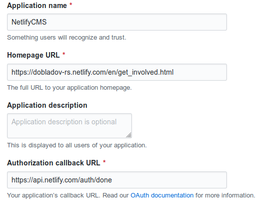

On [Netlify](https://www.netlify.com/) create a new deploy choosing the repository and using this configuration.

`Build & deploy` -> `Build settings`

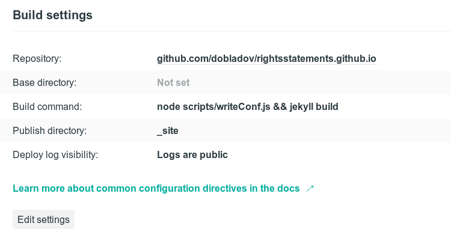

`Build & deploy` -> `Deploy contexts`

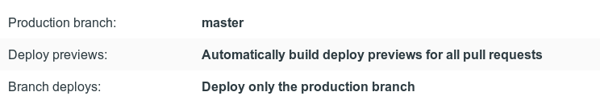

On `Identity`, enable identity with GitHub as external provider.

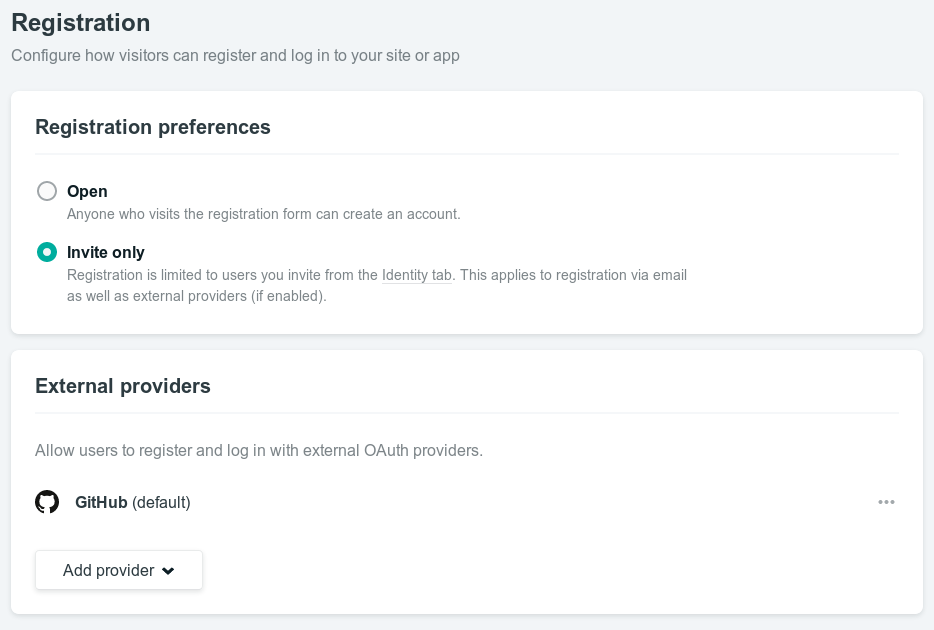

In `Access control` -> `OAuth`, install an new GitHub provider and set the `Client ID` and `Client Secret` generated on GitHub.

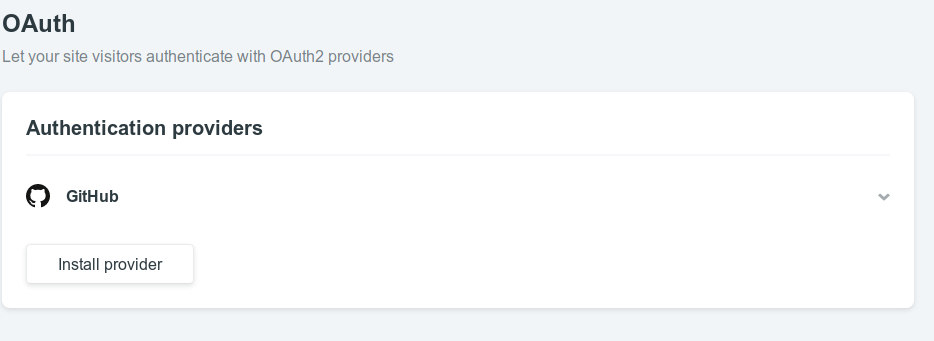

## Implementing translations

ToDo

## Editing content

### Access CMS

Open `/admin` and log in with GitHub.

### Creating a new post

[Transifex](https://www.transifex.com/graphthinking-gmbh/rightsstatementsorg/) is used to carry out translations of the website. The relevant resources are tagged with the category `website`. Please get in touch with the [maintainers](https://www.transifex.com/graphthinking-gmbh/rightsstatementsorg/settings/maintainers/) to add a new language to the project.

To incorporate updates or new translations:

* Install [`tx`](https://docs.transifex.com/client/introduction) and run [`tx pull`](https://docs.transifex.com/client/pull#command-options).
* Edit `_config.yml` and `_config_production.yml` to add keys and associated translations for the language you're editing.
* If provided, add any PDF documentation related to the translation to the `files` directory.

Add a **title**, **date**, **body** and click save.

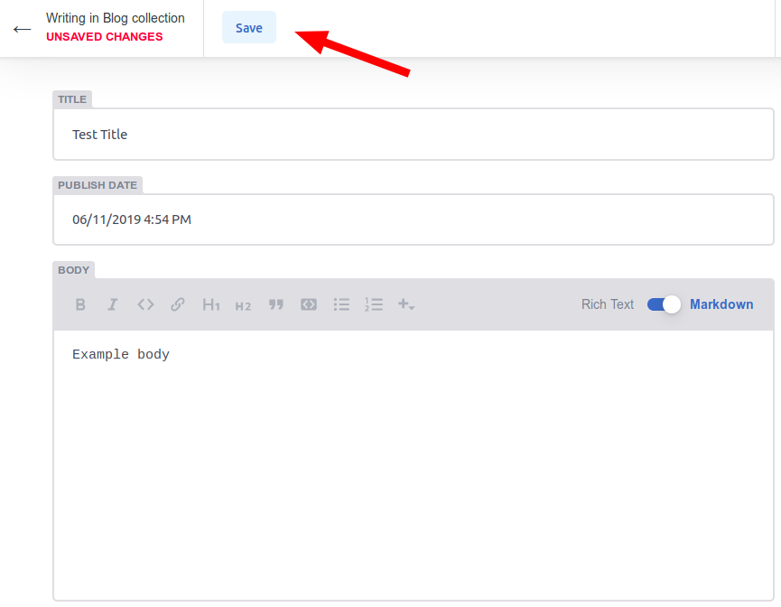

**By default new post are not published** and have the status *draft*, to publish them is necessary to click the `Publish` button

Is also possible to see a preview of the post by clicking `View Preview`, this link takes a while to load since new previews trigger separate build.

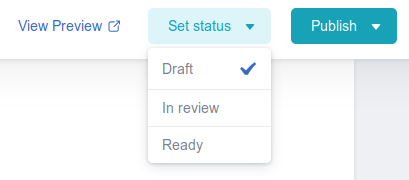

Changing the status will only affect how is shown in the workflow view and not publish it.

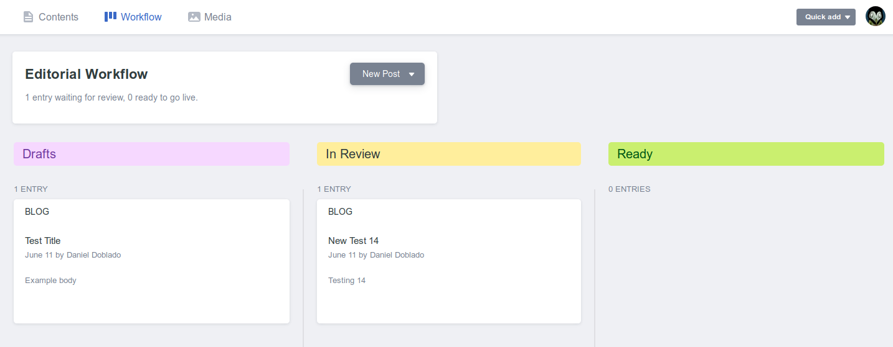

## Managing assets

Click media on the top bar.

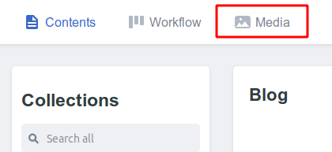

Click upload and choose your asset.

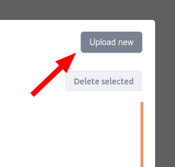

New images can be added by pressing the button in the editor.

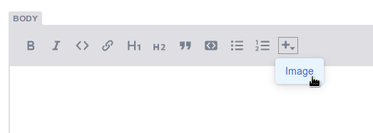

Other files must be added as markdown.

```
[PDF](/files/160611proposal_for_implementation_UND.pdf)
```
